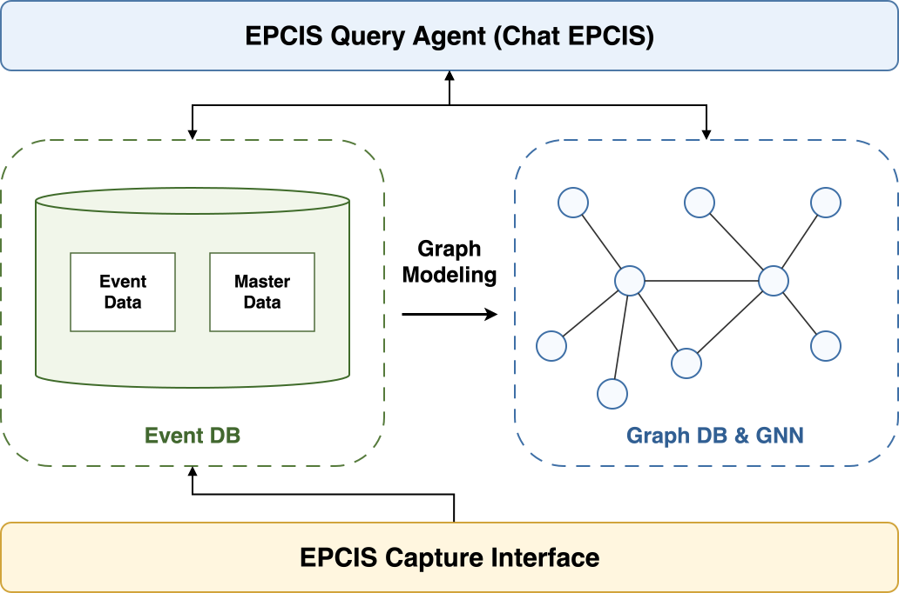
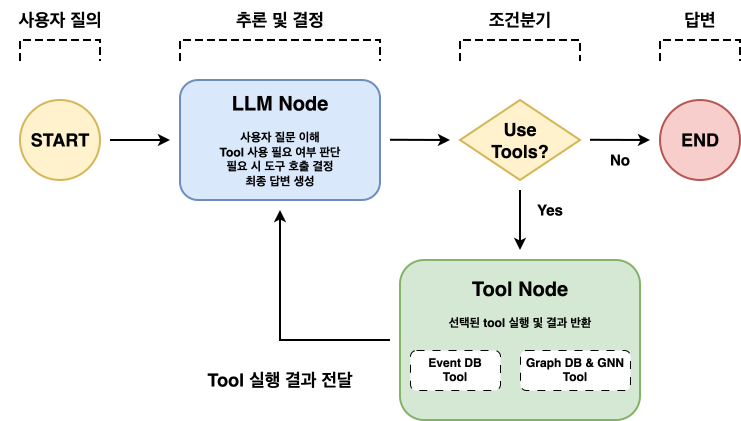

# Overview

  

# Workflow

  

# What is EPCIS?
EPCIS (Electronic Product Code Information Services)는 공급망에서 제품의 이동과 상태를 추적하기 위한 국제 표준입니다. 

EPCIS의 목표는 서로 다른 애플리케이션들이 기업 내부 및 기업 간에 가시성 이벤트 데이터를 생성하고 공유할 수 있도록 하는 것입니다.

[공식문서](https://www.gs1.org/standards/epcis)

# What is Chat EPCIS?
Chat EPCIS는 LLM 및 Graph 모델링 기반 대화형 공급망 국제 표준 GS1 EPCIS 데이터 플랫폼입니다.

기존의 EPCIS 기반 데이터 플랫폼은 두 가지 문제점이 있었습니다:
- 제품의 이력 추적 과정에서 데이터 규모가 증가할수록 재귀적 쿼리로 인해 조회 횟수와 데이터 전송량이 증가하는 확장성 측면의 한계
- 원하는 정보를 얻기 위해서는 사용자가 EPCIS Query를 직접 이해하고 활용해야 한다는 사용성 측면의 한계

이를 해결하기 위해,
- EPCIS Event를 객체 간 관계를 표현하는 graph로 모델링 후 GraphDB인 Neo4j에 저장 및 관리함으로써 단일 Cypher Query만으로 객체의 이력 추적이 가능하도록 구현
- LangGraph를 사용하여 LLM 기반 Tool-RAG 구조의 Query Agent인 Chat EPCIS 구현 

을 수행하였습니다.

Chat EPCIS를 통해 사용자는 복잡한 Query를 직접 작성하지 않고 자연어 질의를 통해 필요한 정보를 획득할 수 있으며, 
- EPCIS Event를 저장하는 MongoDB 활용 Tool
- Graph를 저장하는 Neo4j 활용 Tool
- Graph 데이터 기반의 GNN 모델 활용 Tool

와 같은 tool들을 연동함으로써 보다 다양하고 정확한 정보를 제공받을 수 있습니다.

기타 정보:
- Graph 모델링의 경우 다음 논문에서 사용된 모델링 기법을 참고하여 활용하였습니다:
  - [Object traceability graph: Applying temporal graph traversals for efficient object traceability](https://doi.org/10.1016/j.eswa.2020.113287)
- LLM 모델은 Ollama를 통해 Gemma4-e2b 모델을 사용하였습니다. 

